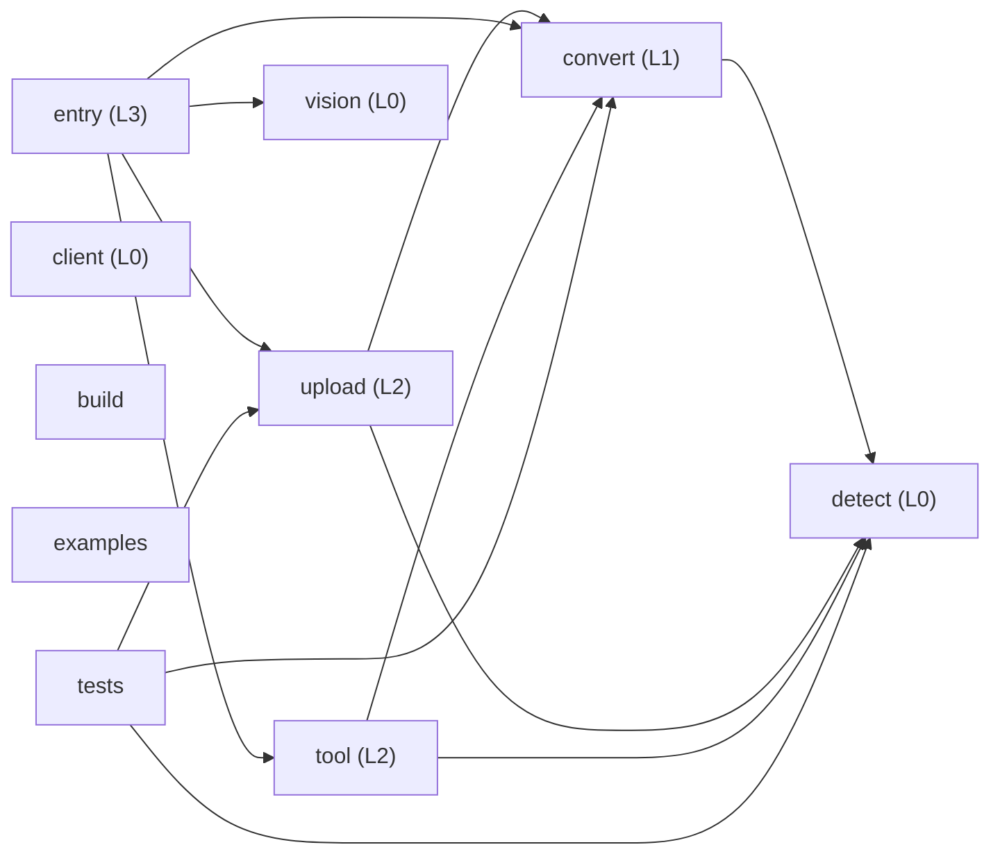

# dsh-file-upload — Architecture Digest

> Generated 2026-10-06 by the `structure-guard` skill (`guard.mjs digest`).
> Tables and metrics are regenerated on every run. Text inside the CURATED block, and the
> `describe` map in `.structure/guard.json`, are yours and are never overwritten.

## 1. Identity

| Field | Value |
| --- | --- |
| Package name | dsh-file-upload |
| Version | 0.5.3 |
| Layout archetype | single-package-src |
| Primary language | typescript |
| Languages by volume | typescript (1970 LOC), typescriptreact (580 LOC), javascript (27 LOC) |
| Module system | esm |
| Package manager | pnpm |
| Engines | {"node":">=22.6.0"} |
| Runtime deps | 4 |
| Dev deps | 5 |
| Peer deps | 6 |
| Exports map | yes |
| License | MIT |
| Repository declared | yes |
| Git | 21 commits, last 2026-10-06T15:06:13+08:00, 2 dirty files |

## 2. Layout at a glance

| Top level | Kind | Files | LOC | Source | Tests | Purpose (curated) |
| --- | --- | --- | --- | --- | --- | --- |
| `.github/` | directory | 2 | 74 | 0 | 0 |  |
| `.gitignore` | file | 1 | 15 | 0 | 0 |  |
| `.test-nonwritable/` | directory | 2 | 2 | 0 | 0 |  |
| `AGENTS.md` | file | 1 | 59 | 0 | 0 |  |
| `ARCHITECTURE.md` | file | 1 | 217 | 0 | 0 |  |
| `CHANGELOG.md` | file | 1 | 292 | 0 | 0 |  |
| `CONTRIBUTING.md` | file | 1 | 46 | 0 | 0 |  |
| `INSTALL.md` | file | 1 | 151 | 0 | 0 |  |
| `LICENSE` | file | 1 | 0 | 0 | 0 |  |
| `README.md` | file | 1 | 141 | 0 | 0 |  |
| `README.zh.md` | file | 1 | 134 | 0 | 0 |  |
| `SECURITY.md` | file | 1 | 24 | 0 | 0 |  |
| `build.mjs` | file | 1 | 27 | 1 | 0 |  |
| `cordis.patch.yml` | file | 1 | 30 | 0 | 0 |  |
| `examples/` | directory | 1 | 33 | 0 | 0 | cordis.patch.yml 的本地覆盖示例，文档性质。 |
| `package.json` | file | 1 | 91 | 0 | 0 |  |
| `pnpm-lock.yaml` | file | 1 | 0 | 0 | 0 |  |
| `src/` | directory | 7 | 2036 | 7 | 0 |  |
| `test/` | directory | 4 | 514 | 0 | 4 |  |
| `tsconfig.build.json` | file | 1 | 15 | 0 | 0 |  |
| `tsconfig.json` | file | 1 | 17 | 0 | 0 |  |

Root holds 16 loose file(s): `.gitignore`, `AGENTS.md`, `ARCHITECTURE.md`, `CHANGELOG.md`, `CONTRIBUTING.md`, `INSTALL.md`, `LICENSE`, `README.md`, `README.zh.md`, `SECURITY.md`, `build.mjs`, `cordis.patch.yml`, `package.json`, `pnpm-lock.yaml`, `tsconfig.build.json`, `tsconfig.json`

## 3. Modules

| Module | Layer | Files | LOC | Source | Tests | Entry | May import (declared) | Actually imports | Purpose (curated) |
| --- | --- | --- | --- | --- | --- | --- | --- | --- | --- |
| `convert` | 1 | 1 | 282 | 1 | 0 | `src/convert.ts` | `detect` | `detect` | 文档转 Markdown 的适配层：唯一允许调用外部转换器（markitdown/mammoth/pdfjs/read-excel-file）的模块。 |
| `upload` | 2 | 1 | 332 | 1 | 0 | `src/upload.ts` | `detect`, `convert` | `convert`, `detect` | 上传处理与清理：接收浏览器分片、落盘、哈希去重、定期回收临时文件。唯一允许写磁盘的模块。 |
| `detect` | 0 | 1 | 151 | 1 | 0 | `src/detect.ts` | _nothing_ | — | 文件类型嗅探（魔数 + 扩展名）。叶子模块，不 import 项目内任何东西。 |
| `vision` | 0 | 1 | 162 | 1 | 0 | `src/vision.ts` | _nothing_ | — | 图片描述能力封装。叶子模块，供 entry 在需要视觉理解时调用。 |
| `entry` | 3 | 1 | 302 | 1 | 0 | `src/index.ts` | `tool`, `upload`, `convert`, `detect`, `vision` | `convert`, `tool`, `upload`, `vision` | 宿主插件入口：注册上传服务与 read_document 工具，只做装配，不写业务逻辑。 |
| `tool` | 2 | 1 | 227 | 1 | 0 | `src/tool.ts` | `detect`, `convert` | `convert`, `detect` | 面向模型的 read_document 工具定义、参数 schema 与解析缓存 ParseCache。 |
| `client` | 0 | 1 | 580 | 1 | 0 | `src/client/index.tsx` | _nothing_ | — | 浏览器半边：React/TSX，只依赖 react 与 dsh-client-ui-primitives，禁止 import 宿主代码。 |
| `build` | — | 1 | 27 | 1 | 0 | `build.mjs` | _undeclared_ | — | 构建脚本：tsc 产物之后的 client bundle 收尾。 |
| `examples` | — | 1 | 33 | 0 | 0 | — | `*` | — | cordis.patch.yml 的本地覆盖示例，文档性质。 |
| `tests` | — | 4 | 514 | 0 | 4 | — | `*` | `convert`, `detect`, `upload` | node:test 测试，顶层 test/ + *.test.ts 命名。 |

_17 tracked file(s) belong to no declared module: `.github/workflows/ci.yml`, `.github/workflows/structure-guard.yml`, `.gitignore`, `.test-nonwritable/markitdown/.markitdown-installed.json`, `.test-nonwritable/markitdown/.probe`, `AGENTS.md`, `ARCHITECTURE.md`, `CHANGELOG.md`, …. Either declare them or move them where the contract covers them._

### Declared module graph

## 4. Conventions observed

| Aspect | Observed |
| --- | --- |
| File naming | flat: 8 |
| Naming consistency | 100% (dominant: flat) |
| Test placement | top-level |
| Test volume | 4 files / 514 LOC (ratio 0.5) |
| Source roots | `src/` |
| Barrel files (index.*) | present |
| Scripts | `build`, `typecheck`, `test`, `prepublishOnly` |

## 5. Structural health

| Metric | Value |
| --- | --- |
| Files tracked | 32 (338 KB) |
| Source | 8 files / 2063 LOC |
| Tests | 4 files / 514 LOC |
| Docs | 8 files / 1064 LOC |
| Config files | 10 |
| Generated artifacts tracked | 0 |
| Vendored files tracked | 0 |
| Max nesting depth | 2 |
| Average source file | 258 lines |
| Largest source file | `src/client/index.tsx` (580 lines) |
| Import graph | 8 nodes / 15 internal edges (6 cross-directory) |
| Import cycles | 0 |
| Unresolved relative imports | 0 |
| Most depended-on files | `src/convert.ts` (5), `src/detect.ts` (5), `src/upload.ts` (3) |
| Churn hotspots (90d) | `README.md` (14), `README.zh.md` (14), `src/index.ts` (14) |

## 6. Standards checklist

| Artifact | Status |
| --- | --- |
| README | present |
| LICENSE | present |
| CHANGELOG | present |
| CONTRIBUTING | present |
| ARCHITECTURE / DESIGN | present |
| SECURITY | present |
| docs/ directory | **missing** |
| ADR / RFC directory | **missing** |
| CI workflow | present |
| linter config | **missing** |
| formatter config | **missing** |
| .editorconfig | **missing** |
| type config (tsconfig/mypy) | present |
| test runner config | **missing** |
| lockfile | present |
| .gitignore | present |
| .gitattributes | **missing** |
| issue templates | **missing** |
| PR template | **missing** |
| commit hooks / lint-staged | **missing** |
| release automation | **missing** |
| examples/ | present |
| benchmarks/ | **missing** |
| Dockerfile | **missing** |

## 7. Open findings

### Rule findings

- **warn** `committed-runtime-artifacts` — 2 runtime artifact(s) are tracked in git.
- **warn** `long-functions` — 1 function(s) exceed 150 lines; the longest is createUploadHandler at 200.
- **warn** `no-linter` — No linter or formatter configuration found.
- **info** `churn-hotspots` — 1 file(s) are both frequently changed and widely imported.
- **info** `stale-entry-points` — 2 entry point(s) are untracked build output.

<!-- BEGIN CURATED -->
## 8. Intent (curated — never regenerated)

`dsh-file-upload` 是 DeepSeek Harness 的文件上传与文档解析插件：浏览器半边把文件送到宿主，宿主半边嗅探类型、调用外部转换器（MarkItDown / mammoth / pdfjs / read-excel-file）转成 Markdown，并把 `read_document` 工具、上传处理器和临时文件回收器注册进 Cordis。

### 不可违背的边界

- **依赖只能向内**：`entry (L3) → tool / upload (L2) → convert (L1) → detect / vision (L0)`。反向 import 是 error。
- **`src/client/**` 是浏览器半边**：只允许依赖 `react` 与 `@deepseek-ai/dsh-client-ui-primitives`，**禁止 import 任何宿主模块（含类型）**。需要共享类型时复制一份到 client 侧，或抽成独立的 `.d.ts`。
- **`detect` 与 `vision` 是叶子**：不 import 项目内任何模块。
- **只有 `convert.ts` 允许调用外部转换器**：新增文档格式就在这里加适配器，不要在 `tool.ts` / `upload.ts` 里直接引入第三方转换器。
- **只有 `upload.ts` 允许写磁盘**（临时上传目录）：其他模块通过它拿路径。
- 以上每条都写进了 `.structure/guard.json` 的 `modules` / `boundaries` / `layer`，由 `guard.mjs audit` 机械校验，不是口头约定。

### 新代码放在哪里

- 新的文档格式支持 → `src/convert.ts` 加适配器，`test/convert.test.ts` 加用例
- 新的模型工具 → `src/tool.ts`，并在 `src/index.ts` 注册（入口只做装配）
- 新的宿主服务 / HTTP 处理 → `src/upload.ts`，或新建 `src/<name>.ts` 并同步登记 modules + boundaries
- 新的浏览器 UI → `src/client/`，保持零宿主依赖
- 类型嗅探规则 → `src/detect.ts`

### 监控与 CI 接线（2026-09-27 补）

- **AGENTS.md**（由 `guard.mjs agents .` 生成）：把本文档的模块契约、层级、禁止事项和监控命令写成编码 Agent 最先读到的形式，表格从 `.structure/guard.json` 派生，因此不会和实际校验规则脱节；CURATED 区块同样受保护。表格过时用 `guard.mjs agents . --check` 检测。
- **CI**：已执行 `guard.mjs ci install .`，把引擎完整 vendored 到 `.dsh/structure-guard/`（含 `PROVENANCE.json` 校验和）并写入 `.github/workflows/structure-guard.yml`：`audit` 遇 error 让构建失败，`digest --check` 保证本文档不过期，报告作为 artifact 上传。升级技能后用 `ci install --force` 重新同步；完全移除用 `ci remove --purge`。
- **发布前**：`guard.mjs verify .` = 结构门禁 + `typecheck` + `test` + `build`（当前 6.6s 全绿）。**
- **对标业界**：`guard.mjs remote <owner/repo>` 不克隆即可查看任意 GitHub 项目的布局，`--compare .` 直接对照。当前与 cordis 的差距：根目录散落文件 19 vs 15、顶层入口 5 vs 2、缺 linter/formatter/.editorconfig/.gitattributes。

### 已知例外与待办

- **`long-functions`**：`apply()`（`src/index.ts`）已在 `rules.overrides` 中豁免并写明理由——它是 Cordis 插件体，注册逻辑天然在同一个闭包作用域里（cordiverse/cordis 自身插件也是如此）。`createUploadHandler()`（`src/upload.ts`，**200 行**，2026-10-06 由 186 行增长）**未豁免**，是待拆分项：建议抽出「接收分片 / 校验哈希 / 落盘 / 响应」四个具名步骤；本轮把视觉调用移出并发闸时又加长了它，**拆分优先级应上调**。`src/upload.ts` 同时被标记为 **churn hotspot**（90 天 12 次提交、3 个 importer）——先稳定它的接口，测试也优先补在这里。
- **运行时产物被误提交**：`.test-nonwritable/markitdown/.probe` 与 `.markitdown-installed.json`（commit `7fdc463`）。处理：`git rm -r --cached .test-nonwritable` 并在 `.gitignore` 加 `.test-nonwritable/`。
- **缺少 linter / formatter 配置**：18 个参照仓库全部具备（vscode 甚至自建 `.eslint-plugin-local/` 49 条规则来机械强制分层）。建议加 `eslint.config.js` 或 biome，然后 `guard.mjs hook install . --strict` 并接入 CI。
- **`lib/` 是构建产物**：已在 `package.json` 的 `files` 中声明且被 gitignore，报告里以 info 提示，属预期，不需要处理。
- **`INSTALL.md`（2026-10-06 新增，有意引入的顶层文档）**：安装与排障手册，属 `single-package-src` 原型下的
  标准根级文档（与 `README` / `CONTRIBUTING` / `SECURITY` 同类），因此按规则在本文档登记后重新 baseline。
  内容：`dsh plugin --profile <name> add …` 的两条路径（registry 与本地 `link:`）、管理器实际写入
  profile manifest 的两处（`dependencies` 与 `dsh.profile.bundles`）、用 `--dump-config` 不启动应用即可
  验证装载的配方、以及「peer 区间不兼容被拒」「registry 不可达」「装完按钮不出现」「row id 说明」四类排障。
  **该文件不引入任何新模块边界**，不参与 import 图。

### 监控方式

- 提交前：`.git/hooks/pre-commit` 已安装 structure-guard 区块（error 阻断，warn 不阻断；`git commit --no-verify` 可单次绕过）。
- 结构变更后：`node ~/.dsh/skills/structure-guard/scripts/guard.mjs audit .`
- 有意变更后：先在本文档记录理由 → 改 `.structure/guard.json` → `guard.mjs baseline .` → `guard.mjs digest .`
<!-- END CURATED -->
