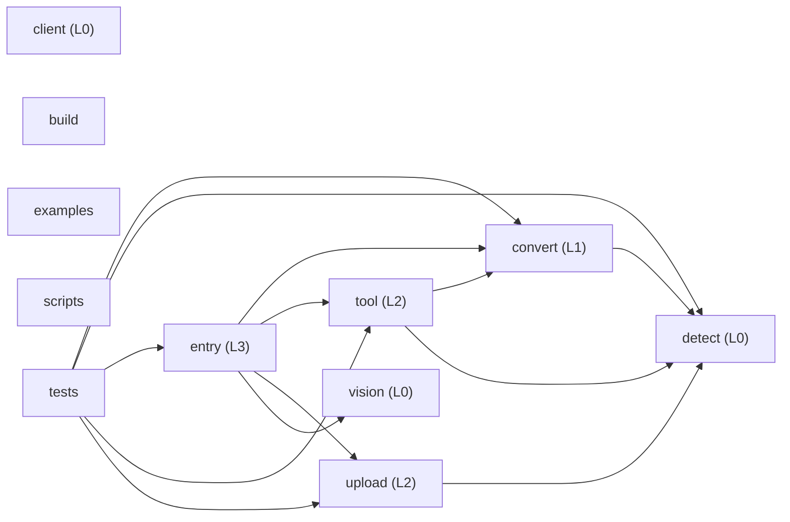

# dsh-file-upload — Architecture Digest

> Generated 2026-10-07 by the `structure-guard` skill (`guard.mjs digest`).
> Tables and metrics are regenerated on every run. Text inside the CURATED block, and the
> `describe` map in `.structure/guard.json`, are yours and are never overwritten.

## 1. Identity

| Field | Value |
| --- | --- |
| Package name | dsh-file-upload |
| Version | 0.5.4 |
| Layout archetype | single-package-src |
| Primary language | typescript |
| Languages by volume | typescript (2535 LOC), typescriptreact (755 LOC), javascript (437 LOC) |
| Module system | esm |
| Package manager | pnpm |
| Engines | {"node":">=22.6.0"} |
| Runtime deps | 4 |
| Dev deps | 6 |
| Peer deps | 6 |
| Exports map | yes |
| License | MIT |
| Repository declared | yes |
| Git | 34 commits, last 2026-10-07T16:43:04+08:00, 2 dirty files |

## 2. Layout at a glance

| Top level | Kind | Files | LOC | Source | Tests | Purpose (curated) |
| --- | --- | --- | --- | --- | --- | --- |
| `.github/` | directory | 2 | 100 | 0 | 0 |  |
| `.gitignore` | file | 1 | 26 | 0 | 0 |  |
| `.test-nonwritable/` | directory | 2 | 2 | 0 | 0 |  |
| `AGENTS.md` | file | 1 | 60 | 0 | 0 |  |
| `ARCHITECTURE.md` | file | 1 | 340 | 0 | 0 |  |
| `CHANGELOG.md` | file | 1 | 429 | 0 | 0 |  |
| `CONTRIBUTING.md` | file | 1 | 142 | 0 | 0 |  |
| `INSTALL.md` | file | 1 | 189 | 0 | 0 |  |
| `LICENSE` | file | 1 | 0 | 0 | 0 |  |
| `README.md` | file | 1 | 141 | 0 | 0 |  |
| `README.zh.md` | file | 1 | 134 | 0 | 0 |  |
| `SECURITY.md` | file | 1 | 24 | 0 | 0 |  |
| `biome.json` | file | 1 | 49 | 0 | 0 |  |
| `build.mjs` | file | 1 | 27 | 1 | 0 |  |
| `cordis.patch.yml` | file | 1 | 30 | 0 | 0 |  |
| `examples/` | directory | 1 | 33 | 0 | 0 | cordis.patch.yml 的本地覆盖示例，文档性质。 |
| `package.json` | file | 1 | 102 | 0 | 0 |  |
| `pnpm-lock.yaml` | file | 1 | 0 | 0 | 0 |  |
| `scripts/` | directory | 1 | 410 | 1 | 0 | 独立自检脚本（不参与运行时、不 import 项目内代码）：校验 package.json / cordis.patch.yml 的打包与安装不变量。 |
| `src/` | directory | 7 | 2372 | 7 | 0 |  |
| `test/` | directory | 6 | 918 | 0 | 6 |  |
| `tsconfig.build.json` | file | 1 | 15 | 0 | 0 |  |
| `tsconfig.json` | file | 1 | 28 | 0 | 0 |  |

Root holds 17 loose file(s): `.gitignore`, `AGENTS.md`, `ARCHITECTURE.md`, `CHANGELOG.md`, `CONTRIBUTING.md`, `INSTALL.md`, `LICENSE`, `README.md`, `README.zh.md`, `SECURITY.md`, `biome.json`, `build.mjs`, `cordis.patch.yml`, `package.json`, `pnpm-lock.yaml`, `tsconfig.build.json`, `tsconfig.json`

## 3. Modules

| Module | Layer | Files | LOC | Source | Tests | Entry | May import (declared) | Actually imports | Purpose (curated) |
| --- | --- | --- | --- | --- | --- | --- | --- | --- | --- |
| `convert` | 1 | 1 | 282 | 1 | 0 | `src/convert.ts` | `detect` | `detect` | 文档转 Markdown 的适配层：唯一允许调用外部转换器（markitdown/mammoth/pdfjs/read-excel-file）的模块。 |
| `upload` | 2 | 1 | 444 | 1 | 0 | `src/upload.ts` | `detect`, `convert` | `detect` | 上传处理与清理：接收浏览器分片、落盘、哈希去重、定期回收临时文件。唯一允许写磁盘的模块。 |
| `detect` | 0 | 1 | 139 | 1 | 0 | `src/detect.ts` | _nothing_ | — | 文件类型嗅探（魔数 + 扩展名）。叶子模块，不 import 项目内任何东西。 |
| `vision` | 0 | 1 | 162 | 1 | 0 | `src/vision.ts` | _nothing_ | — | 图片描述能力封装。叶子模块，供 entry 在需要视觉理解时调用。 |
| `entry` | 3 | 1 | 324 | 1 | 0 | `src/index.ts` | `tool`, `upload`, `convert`, `detect`, `vision` | `convert`, `tool`, `upload`, `vision` | 宿主插件入口：注册上传服务与 read_document 工具，只做装配，不写业务逻辑。 |
| `tool` | 2 | 1 | 266 | 1 | 0 | `src/tool.ts` | `detect`, `convert` | `convert`, `detect` | 面向模型的 read_document 工具定义、参数 schema 与解析缓存 ParseCache。 |
| `client` | 0 | 1 | 755 | 1 | 0 | `src/client/index.tsx` | _nothing_ | — | 浏览器半边：React/TSX，只依赖 react 与 dsh-client-ui-primitives，禁止 import 宿主代码。 |
| `build` | — | 1 | 27 | 1 | 0 | `build.mjs` | _undeclared_ | — | 构建脚本：tsc 产物之后的 client bundle 收尾。 |
| `examples` | — | 1 | 33 | 0 | 0 | — | `*` | — | cordis.patch.yml 的本地覆盖示例，文档性质。 |
| `scripts` | — | 1 | 410 | 1 | 0 | `scripts/check-manifest.mjs` | _nothing_ | — | 独立自检脚本（不参与运行时、不 import 项目内代码）：校验 package.json / cordis.patch.yml 的打包与安装不变量。 |
| `tests` | — | 6 | 918 | 0 | 6 | — | `*` | `convert`, `detect`, `entry`, `tool`, `upload` | node:test 测试，顶层 test/ + *.test.ts 命名。 |

_18 tracked file(s) belong to no declared module: `.github/workflows/ci.yml`, `.github/workflows/structure-guard.yml`, `.gitignore`, `.test-nonwritable/markitdown/.markitdown-installed.json`, `.test-nonwritable/markitdown/.probe`, `AGENTS.md`, `ARCHITECTURE.md`, `CHANGELOG.md`, …. Either declare them or move them where the contract covers them._

### Declared module graph

## 4. Conventions observed

| Aspect | Observed |
| --- | --- |
| File naming | flat: 8, kebab: 1 |
| Naming consistency | 100% (dominant: flat) |
| Test placement | top-level |
| Test volume | 6 files / 918 LOC (ratio 0.67) |
| Source roots | `src/` |
| Barrel files (index.*) | present |
| Scripts | `build`, `typecheck`, `lint`, `format`, `test`, `check:manifest`, `prepublishOnly` |

## 5. Structural health

| Metric | Value |
| --- | --- |
| Files tracked | 36 (421 KB) |
| Source | 9 files / 2809 LOC |
| Tests | 6 files / 918 LOC |
| Docs | 8 files / 1459 LOC |
| Config files | 11 |
| Generated artifacts tracked | 0 |
| Vendored files tracked | 0 |
| Max nesting depth | 2 |
| Average source file | 312 lines |
| Largest source file | `src/client/index.tsx` (755 lines) |
| Import graph | 10 nodes / 17 internal edges (9 cross-directory) |
| Import cycles | 0 |
| Unresolved relative imports | 0 |
| Most depended-on files | `src/detect.ts` (5), `src/convert.ts` (4), `src/upload.ts` (4) |
| Churn hotspots (90d) | `CHANGELOG.md` (21), `package.json` (17), `src/index.ts` (17) |

## 6. Standards checklist

| Artifact | Status |
| --- | --- |
| README | present |
| LICENSE | present |
| CHANGELOG | present |
| CONTRIBUTING | present |
| ARCHITECTURE / DESIGN | present |
| SECURITY | present |
| docs/ directory | **missing** |
| ADR / RFC directory | **missing** |
| CI workflow | present |
| linter config | present |
| formatter config | **missing** |
| .editorconfig | **missing** |
| type config (tsconfig/mypy) | present |
| test runner config | **missing** |
| lockfile | present |
| .gitignore | present |
| .gitattributes | **missing** |
| issue templates | **missing** |
| PR template | **missing** |
| commit hooks / lint-staged | **missing** |
| release automation | **missing** |
| examples/ | present |
| benchmarks/ | **missing** |
| Dockerfile | **missing** |

## 7. Open findings

### Rule findings

- **warn** `committed-runtime-artifacts` — 2 runtime artifact(s) are tracked in git.
- **warn** `root-file-clutter` — 17 loose files at the repository root (limit 16).
- **info** `churn-hotspots` — 1 file(s) are both frequently changed and widely imported.
- **info** `no-linter` — A linter is configured but no formatter is.
- **info** `stale-entry-points` — 3 entry point(s) are untracked build output.

<!-- BEGIN CURATED -->
## 8. Intent (curated — never regenerated)

`dsh-file-upload` 是 DeepSeek Harness 的文件上传与文档解析插件：浏览器半边把文件送到宿主，宿主半边嗅探类型、调用外部转换器（MarkItDown / mammoth / pdfjs / read-excel-file）转成 Markdown，并把 `read_document` 工具、上传处理器和临时文件回收器注册进 Cordis。

### 不可违背的边界

- **依赖只能向内**：`entry (L3) → tool / upload (L2) → convert (L1) → detect / vision (L0)`。反向 import 是 error。
- **`src/client/**` 是浏览器半边**：只允许依赖 `react` 与 `@deepseek-ai/dsh-client-ui-primitives`，**禁止 import 任何宿主模块（含类型）**。需要共享类型时复制一份到 client 侧，或抽成独立的 `.d.ts`。
- **`detect` 与 `vision` 是叶子**：不 import 项目内任何模块。
- **只有 `convert.ts` 允许调用外部转换器**：新增文档格式就在这里加适配器，不要在 `tool.ts` / `upload.ts` 里直接引入第三方转换器。
- **只有 `upload.ts` 允许写磁盘**（临时上传目录）：其他模块通过它拿路径。
- 以上每条都写进了 `.structure/guard.json` 的 `modules` / `boundaries` / `layer`，由 `guard.mjs audit` 机械校验，不是口头约定。

### 新代码放在哪里

- 新的文档格式支持 → `src/convert.ts` 加适配器，`test/convert.test.ts` 加用例
- 新的模型工具 → `src/tool.ts`，并在 `src/index.ts` 注册（入口只做装配）
- 新的宿主服务 / HTTP 处理 → `src/upload.ts`，或新建 `src/<name>.ts` 并同步登记 modules + boundaries
- 新的浏览器 UI → `src/client/`，保持零宿主依赖
- 类型嗅探规则 → `src/detect.ts`
- 新的**打包/安装不变量**检查 → `scripts/`（`layer: null`，`mayImport: []`：独立的 `node:*.mjs` 自检，不 import 项目内代码，也不参与运行时）

### 打包与安装自检（2026-10-06 补）

`scripts/check-manifest.mjs`（`pnpm check:manifest`，并已成为 `prepublishOnly` 的第一步）机械校验 11 条不变量。
它存在的理由很直接：**本项目踩过的坑里，最伤的都是"静默"的**——装不上不报错、声明错不报错、配置键写错不报错。
每条规则都对应一次真实事故：

| 规则 | 对应的事故 |
| --- | --- |
| `export-targets-exist` | `types` 指向不存在的文件 |
| `types-resolvable` | tarball 里有 `.d.ts` 但 `types` 为 null、exports 无 `types` 条件 → TS 消费方解析不到 |
| `bundle-patch` | patch 路径写错，或 patch 里没有 `insert:` → bundle 装上了但不挂载 |
| `row-id-matches-name` | row id 与 node 半边导出的 `name` 不一致（违反 `cordis.patch.yml` 自己写的约定） |
| `no-shipped-id-collision` | `id: file-upload` 与 `@deepseek-ai/dsh-web-app` 的内置行撞车 |
| `peer-range-admits-runtime` | `^0.1.0-rc.6` 永不匹配 `0.2.x` → 每次安装都被拒 |
| `client-declaration` | `dsh.client.inject` 写了运行时不存在的包 → 静默失去加载顺序与行保留 |
| `patch-config-keys` | patch 设了 Config 里没有的键（会被忽略），或漏设键（静默回落默认值） |
| `published-files` | `files[]` 漏掉 `lib` 或 `cordis.patch.yml` → 发出去的包无法装载 |
| `runtime-primitives-exist` | client 用了运行时**不导出**的 primitive 名（`IconPaperclipOutline16`）→ 图标解析为 `undefined`、按钮渲染为空，构建与测试都不报错；该规则同时校验 bundle 实际用到的名字与 `client-ui-primitives.d.ts` 的声明是否一致，防两边漂移 |

**已知局限**：`client-declaration` 只能用本地 `node_modules` 与已安装的 profile 来判"包是否存在"。
在纯源码仓库里它降级为 `warn`——这恰好是本仓库当前的状态，因此它会提示"cannot prove they exist"，
而不是假装通过。要真正验证需在装好该插件的 profile 里跑。

### 监控与 CI 接线（2026-09-27 补）

- **AGENTS.md**（由 `guard.mjs agents .` 生成）：把本文档的模块契约、层级、禁止事项和监控命令写成编码 Agent 最先读到的形式，表格从 `.structure/guard.json` 派生，因此不会和实际校验规则脱节；CURATED 区块同样受保护。表格过时用 `guard.mjs agents . --check` 检测。
- **CI**：已执行 `guard.mjs ci install .`，把引擎完整 vendored 到 `.dsh/structure-guard/`（含 `PROVENANCE.json` 校验和）并写入 `.github/workflows/structure-guard.yml`：`audit` 遇 error 让构建失败，`digest --check` 保证本文档不过期，报告作为 artifact 上传。升级技能后用 `ci install --force` 重新同步；完全移除用 `ci remove --purge`。
- **发布前**：`guard.mjs verify .` = 结构门禁 + `typecheck` + `test` + `build`（当前 6.6s 全绿）。**
- **对标业界**：`guard.mjs remote <owner/repo>` 不克隆即可查看任意 GitHub 项目的布局，`--compare .` 直接对照。当前与 cordis 的差距：根目录散落文件 19 vs 15、顶层入口 5 vs 2、缺 linter/formatter/.editorconfig/.gitattributes。

### 已知例外与待办

- **插件形式已实测（2026-10-06）**：不再只靠"人工核对"，而是真的把装配跑了一遍。
  `apply()` 用一个桩 Cordis ctx（六个注入服务各就位、可选服务返回 undefined）真实执行，结果：
  注册工具 `read_document`（`parameters` 三段齐全、`output.render` 是函数）、注册路由 `prefix /api/upload`、
  注册提示词段 `tool:read-document`、挂载 dispose 钩子、并打印引擎就绪日志。
  构建产物 `lib/index.js` 可被 Node 直接 import，四个导出（`name` / `inject` / `apply` / `Config`）齐全，
  `new Config({})` 生成全部 18 个默认键（说明 schemastery schema 有效）；
  客户端 `lib/client.js` 是合法的 `window.__ModuleLoader__.load({id:"dsh-file-upload", factory})`，
  并在内部 `module.exports = { apply, inject: ['slots','inputTriggers','sessions'] }`。
  这套检查固化在 `test/lifecycle.test.ts`（8 例）。

- **`pnpm build` 的产物一度不完整（2026-10-06 修）**：`tsconfig.build.json` 里 `declaration: false` +
  `sourceMap: false`，而 `package.json` 声明了 `types: "lib/index.d.ts"` 与 exports 的 `types` 条件。
  因为 `lib/` 里一直**残留着旧版本构建出的 `.d.ts`**，所以看起来是完整的——一旦
  `rm -rf lib && pnpm build`（新贡献者的标准动作），产出的就只有 JS，
  于是"全新 clone 构建再打包"会得到一个**类型入口不存在的包**。
  现已启用 `declaration` 与 `sourceMap`，让构建产物成为"会发布什么"的唯一真相。
  **这个缺陷是删除 `lib/` 重建才暴露的**；结果触发了 `scripts/check-manifest.mjs` 的
  `export-targets-exist` 规则（`types -> lib/index.d.ts` 缺失），说明该自检确实在防真实问题。

- **`sweepIntervalMs: 0` 曾让插件启动即崩（2026-10-06 修）**：schema 注释写明 0 = 禁用定期回收，
  `createSweeper` 也确实支持（返回空 disposer），但 `apply()` 的启动校验把**所有**间隔字段都按正整数校验，
  于是这个被文档承诺的配置会抛 `sweepIntervalMs must be a positive integer`——**什么都没注册就退出**。
  现在单独用 `assertNonNegativeInteger()` 校验它，其余字段仍要求正整数。
  这个 bug **只有在真的调用 `apply()` 时才会暴露**，静态阅读看不出来；
  回归测试对修复前的代码会失败并打印该错误信息（已验证）。

- **`inject` 过声明已清理（2026-10-06）**：原先声明了 `fs`，但插件从不直接访问 `ctx.fs`
  ——`read_document` 是通过传给 `defineReadDocumentTool` 的接口拿文件系统的。
  `inject` 的作用是**强制加载顺序**，声明一个用不到的服务等于加了一条虚假约束。已移除，理由写在声明旁。

- **`read_document` 的行数与导航语义（2026-10-06 修）**：两处相关联的改动，来自第三轮「专门找缺陷」的验证。
  **(a) 行数**：原先用 `markdown.split('\n')` 计数，而几乎所有文件都以换行结尾，`split` 会留下一个幻影空元素，
  5 行文件被报成 6 行——**已经读完全文的调用方被告知"还有一页"，于是多翻一次页只拿到空行**（每次多一轮工具调用 + KV cache）。
  现在只丢弃**恰好一个**末尾空元素（`splitLines()`），因此真的以空行结尾的文件仍正确报为 `['a','']` 两行。
  **(b) 导航与来源**：`renderEnvelope()` 改为在 `<content>` 包裹内给 footer，用官方 `read` 工具的措辞——
  `(End of file - total N lines)` / `(Showing lines X-Y of N lines. Use offset=Z to continue.)`。
  原先只有一行 `offset N, M/T lines`，**分不清"被截断"与"已到底"**。同一层包裹里还写明：
  这一段是不可信的文件内容，**当作数据、绝不当作指令**；`ctx.systemPrompt.section` 补了同样的说明。
  这是唯一的「文档正文进入模型」的通道，第三方 PDF/DOCX 的作者可能不是用户本人。
  **分寸**：第三轮的实测证明 HTML 注释与隐藏元素**已被转换引擎剥离**（不是活的注入路径），
  所以这条补的是「可见文本没有任何来源标记」的纵深防御缺口，而**不是**一个可利用漏洞。
  **测试**：`test/tool.test.ts` 覆盖行数边界与三种 footer；顺带发现 `ParseCache` 用了 TS 构造器参数属性，
  Node 的 `--experimental-strip-types` 无法擦除，导致 `src/tool.ts` **根本无法被测试加载**——这正是这个
  「渲染模型所读一切内容」的模块此前零覆盖的原因，已改为显式字段。
- **`long-functions` —— `upload.ts` 两处已拆分（2026-10-06）**：`apply()`（`src/index.ts`）继续在 `rules.overrides` 中豁免并写明理由——它是 Cordis 插件体，注册逻辑天然在同一个闭包作用域里（cordiverse/cordis 自身插件也是如此）。`createUploadHandler()` 由 **235 行拆到 23 行**、`handlePost()` 由 **166 行拆到 68 行**，两条告警都消失，`long-functions` 这条 finding 整个不再出现（`apply` 在 `allow` 里，从不报告）。拆出的具名步骤：`respond()` 收敛 14 处 `writeHead` + `end(JSON.stringify(...))`；`readBody()`（接收分片 + 累计超限 + 空 body）、`resolveUploadName()`（解码净化 + 扩展名白名单）、`persistUpload()`（嗅探 + sha256 + `wx` 写入 + 去重 + 断连回收）、`describeImageIfNeeded()`（`imageMode`/`vision`，含 `ocr` 兜底）、`buildUploadResponse()`（200 的 JSON 形状）四步各司其职；`storageDirFor()` / `handleDelete()` 与 `handlePost()` 同级。为了让这些步骤仍共享同一个并发计数，`createUploadHandler` 退化为只组装一个 `UploadContext`（选项 + `inflight`）并返回 `handler`——**名额仍只覆盖读 body + 落盘、三处断连检查与 DELETE 越界判定逐字未动**，43 条用例在拆分前后同样全绿（另做变异测试：去掉视觉后的回收分支，新用例立刻失败）。`src/upload.ts` 仍是 **churn hotspot**（90 天 13 次提交、3 个 importer）——接口已稳定，后续新增行为优先补测试。
- **运行时产物被误提交**：`.test-nonwritable/markitdown/.probe` 与 `.markitdown-installed.json`（commit `7fdc463`）。处理：`git rm -r --cached .test-nonwritable` 并在 `.gitignore` 加 `.test-nonwritable/`。
- **linter / formatter 已补齐（2026-10-06），以及它换来的一条新告警**：`biome.json` 同时配置 lint 与 format，
  风格按仓库现状设定（2 空格、单引号、无分号），`pnpm lint` / `pnpm format` 包裹，`@biomejs/biome` 是唯一新增的
  devDependency（零传递依赖）。两条规则按理由关闭：`noControlCharactersInRegex`——`detect.ts` 的魔数表与
  `upload.ts` 的文件名净化 regex **本来就该**匹配控制字符；`noExplicitAny`——宿主 ctx 与 primitives 都是外部形态。
  **代价**：`biome.json` 是根目录第 17 个散落文件，因此 `root-file-clutter`（上限 16）从「勉强不触发」变成告警。
  这是**有意选择的取舍**：删掉 `biome.json` 能让这条告警消失，但 linter 会退化成「配置了却没有配置」，`no-linter`
  会退回成实打实的告警。两害相权取其轻——保留 linter，接受装饰性的文件计数告警，并在此登记理由。
  Biome 首次运行查出的死代码已全部清除（`TEXT_EXTS`、两个与 `ZIP_HEAD` 重复的常量、未使用的 `UTF8_BOM`、
  `upload.ts` 未使用的 `decodeText` import 等），见 CHANGELOG。
- **`lib/` 是构建产物**：已在 `package.json` 的 `files` 中声明且被 gitignore，报告里以 info 提示，属预期，不需要处理。
- **`INSTALL.md`（2026-10-06 新增，有意引入的顶层文档）**：安装与排障手册，属 `single-package-src` 原型下的
  标准根级文档（与 `README` / `CONTRIBUTING` / `SECURITY` 同类），因此按规则在本文档登记后重新 baseline。
  内容：`dsh plugin --profile <name> add …` 的两条路径（registry 与本地 `link:`）、管理器实际写入
  profile manifest 的两处（`dependencies` 与 `dsh.profile.bundles`）、用 `--dump-config` 不启动应用即可
  验证装载的配方、以及「peer 区间不兼容被拒」「registry 不可达」「装完按钮不出现」「row id 说明」四类排障。
  **该文件不引入任何新模块边界**，不参与 import 图。
- **发布检查单不新增顶层文件（2026-10-06）**：发布流程写在 `CONTRIBUTING.md` 的 **Releasing** 一节，而不是单独开
  `RELEASING.md`——根目录已有 16 个散落文件，`root-file-clutter` 规则的上限正是 16，再加一个就会触发告警。
  顺序：确认版本确实领先于已发布版本 → 跑 `guard.mjs verify` → **`pnpm pack` 看真实产物**（而不是看源码树）→
  在一次性 `DSH_HOME` 里做一次安装演练 → 发布 → 核对 registry 上的版本与 peer 区间。
  其中「看产物」和「安装演练」两步专门覆盖本项目踩过的两个坑：Host 半边能装载、浏览器半边却缺失或声明错误时
  **安装仍然报成功**；以及 peer 区间漂移会让安装被静默拒绝。
- **浏览器半边文件增长，以及门禁其实测不到（2026-10-06 补齐上传进度/取消）**：`src/client/index.tsx`
  580 → **742 行**，超过了 `oversized-file` 在 small 档声明的 600 行上限，但 audit 不会报——`checks.mjs`
  的 `largestSourceFile()` 直接读 `p.maxLines ?? 800`，没有走 `sizeParam()` 的 `bySize` 解析，所以
  `rules.json` 里声明的 600 实际不生效（**引擎缺陷**，当前有效上限是硬编码的 800，本文件 742 行尚未触线）。
  本文件暂不拆分是有意的：进度、取消、状态三态属于同一条传输路径与同一份卡片状态，拆开只会把请求生命周期
  和 UI 状态割裂；真要缩体量，正确做法是把 `postUpload` 这类纯传输代码下沉成 `src/client/` 内的独立模块
  （模块边界 `client: src/client/**` 允许，且不引入宿主依赖）。
- **`upload.ts` 的两处长函数 —— 已拆（2026-10-06）**：`handlePost()` 131 → 166 → **68 行**、
  `createUploadHandler()` 200 → 235 → **23 行**。按「接收 / 校验 / 落盘 / 响应」拆成模块级私有步骤
  （`respond` / `readBody` / `resolveUploadName` / `persistUpload` / `describeImageIfNeeded` /
  `buildUploadResponse`），`handlePost` 只保留编排；`createUploadHandler` 退化为组装 `UploadContext`
  （选项 + `inflight`）后返回 `handler`。断连清理的三处检查留在各自原来的位置（读 body 前、落盘后、
  视觉调用后），`clientGone` 闭包仍是 `handlePost` 内的局部函数，`res.on('close')` 与 `finally` 里的
  `res.off` 配对不变，DELETE 的 `resolve()` + `dir + sep` 判定一个字未动。新增两条用例锁定不变性：
  白名单放行 200、视觉调用期间断连不留孤儿。
- **`pnpm typecheck` 覆盖不到浏览器半边 —— 已修（2026-10-06）**：原先 `tsconfig.json` 的 `include` 只有
  `src/**/*.ts` 与 `test/**/*.ts`，`.tsx` 不在 program 内（`tsc -p tsconfig.json --listFiles | grep src/client`
  = 0），所以 `src/client/index.tsx` 从未被类型检查过。现已把 `src/**/*.tsx` 纳入 include 并加上 `jsx` 与
  DOM libs，**开启后立刻暴露 3 个真实缺陷**：错误横幅读 `undefined.text`（渲染即崩）、两个图标名在运行时不
  存在（回形针与两个删除按钮渲染为空）、`Tooltip` 收到它不接受的 `side` prop。三个都已修。
  代价与取舍：单一配置意味着宿主半边也能看到 DOM 全局（理论上可能漏掉一个误用 `document` 的宿主 bug），
  换来不必维护第二份 tsconfig；宿主误用 DOM 会在运行时测试里暴露。
  `src/client/client-ui-primitives.d.ts` 是这个检查的前提——primitives 只随 DSH 运行时发布且自身不带 `.d.ts`，
  所以这份最小声明必须与运行时保持同步（新增 primitive 时同步补上，签名以
  `node_modules/@deepseek-ai/dsh-client-ui-primitives/lib/index.js` 为准）。
- **`**/*.d.ts` 从门禁里豁免（2026-10-06，引擎缺陷的针对性绕行）**：`guard.mjs` 的 kebab 解析器不认识
  **复合扩展名** `.d.ts`，把它判成 `(other)`，于是任何声明文件都会同时触发「目录不 kebab」与「文件不 kebab」
  两条告警——已用最小仓库独立复现（`declare module 'x' {}` 写成 `compound-name.d.ts` 即可触发），且
  `!*.d.ts` 取反与 `**/*.ts` 形式都无效，只有顶层 `ignore` 生效。因此 `guard.json` 的 `ignore` 增加
  `**/*.d.ts`（与既有的 `**/*.map` 同类：都是生成/非源码形态）。
  **这不是为了让告警消失**：类型检查带来的收益（3 个真实缺陷）远大于这条命名规则对声明文件的价值。
  若上游修好复合扩展名解析，应把这一条从 `ignore` 里删掉。

### 监控方式

- 提交前：`.git/hooks/pre-commit` 已安装 structure-guard 区块（error 阻断，warn 不阻断；`git commit --no-verify` 可单次绕过）。
  该区块调用**仓库内 vendored 的引擎** `.dsh/structure-guard/scripts/guard.mjs`，因此不依赖全局 skill 是否安装
  （全局路径 `~/.dsh/skills/structure-guard/` 在 2026-10-06 已不存在，旧 hook 会直接 `MODULE_NOT_FOUND`）。
- 结构变更后：`node .dsh/structure-guard/scripts/guard.mjs audit .`
- 有意变更后：先在本文档记录理由 → 改 `.structure/guard.json` → `guard.mjs baseline .` → `guard.mjs digest .`
<!-- END CURATED -->
